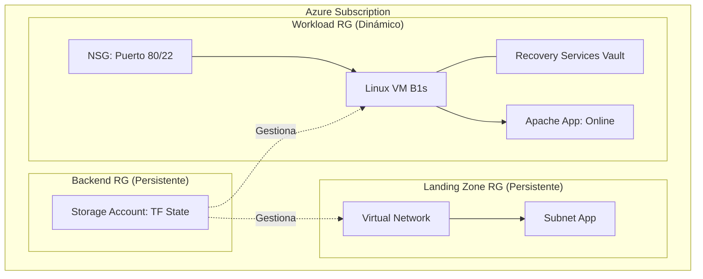

# 🛡️ Azure Enterprise Disaster Recovery Lab


Este laboratorio simula una arquitectura empresarial en Azure diseñada para la resiliencia crítica ante ataques de **Ransomware**. El objetivo es demostrar cómo la Infraestructura como Código (IaC) y las políticas de respaldo permiten reconstruir un entorno productivo íntegro en minutos.

---

## 🎯 Objetivos del Laboratorio

- **Idempotencia Total:** Desplegar infraestructura consistente y reproducible.
- **Gobernanza Cloud:** Implementar estándares de etiquetado (Tags) y control de costos (FinOps).
- **Resiliencia Operativa:** Simular una pérdida total de cómputo y ejecutar un plan de recuperación (DRP).
- **Seguridad por Diseño:** Uso de llaves SSH, Network Security Groups (NSG) y segregación de estados de Terraform.

---

## 🏗️ Arquitectura del Sistema

El despliegue se organiza en tres capas lógicas para garantizar la seguridad y persistencia de los datos:

### 1. Backend (Caja Fuerte - Inamovible)

**Recurso:** Azure Storage Account en un Resource Group dedicado.

**Función:** Almacena el `terraform.tfstate` de forma remota para permitir el trabajo colaborativo y proteger el historial de la infraestructura ante destrucciones accidentales.

### 2. Landing Zone (La Carretera - Inamovible)

**Recurso:** Virtual Network (VNet) y Subnets.

**Función:** Establece el perímetro de red seguro. Es la base estática donde se conectarán los servicios.

### 3. Workload (La Casa - Dinámico)

**Recurso:** Virtual Machine (Ubuntu), Discos y Recovery Services Vault.

**Función:** Es la capa de aplicación. Es dinámica porque en caso de infección por ransomware, esta capa se destruye y se recrea desde el código y los backups.

### Diagrama de Infraestructura


---

## 🛠️ Kit de Herramientas (Scripts Idempotentes)

Todos los scripts están diseñados bajo el principio de SRE: si se ejecutan dos veces, el resultado es el mismo y no causan errores.

| Script | Fase | Función |
|---|---|---|
| `00-pre-check.sh` | Requisitos | Valida versiones de Terraform, Azure CLI y conectividad. |
| `01-create-backend.sh` | Setup | Crea la infraestructura necesaria para el estado remoto. |
| `03-status.sh` | Monitor | Muestra los recursos activos y el estado de la red en tiempo real. |
| `04-simulate-disaster.sh` | Falla | Simula un ataque eliminando quirúrgicamente la VM comprometida. |
| `05-recover-infra.sh` | Recovery | Re-ejecuta Terraform para levantar una infraestructura limpia. |
| `06-full-cleanup.sh` | FinOps | Elimina absolutamente todos los recursos para asegurar costo $0. |
| `07-lab-sentinel.sh` | Auditoría | Monitorea costos por hora y cumplimiento de etiquetas (Tags). |

---

## 🚀 Guía de Inicio Rápido (Runbook)

**1. Preparar el terreno:**
```bash
bash scripts/00-pre-check.sh
bash scripts/01-create-backend.sh
```

**2. Levantar la infraestructura:**
```bash
cd terraform/environments/landingzone && terraform apply -auto-approve
cd ../workload && terraform apply -auto-approve
```

**3. Verificar la aplicación:**

Accede a la IP pública mostrada por `./scripts/07-lab-sentinel.sh`.

**4. Simular desastre y recuperar:**
```bash
bash scripts/04-simulate-disaster.sh
bash scripts/05-recover-infrastructure.sh
```

---

## 🛡️ Mejores Prácticas Aplicadas

- **Seguridad:** `.gitignore` configurado para evitar la carga de secretos y llaves SSH al repositorio.
- **Nomenclatura:** Estándar `[prefijo]-[recurso]-[entorno]` para fácil auditoría.
- **Menor Privilegio:** Uso de Service Principals o logins locales limitados al Resource Group de trabajo.
- **FinOps:** Uso de máquinas tipo B1s y discos LRS para minimizar costos (aprox. $0.06 por sesión de 4h).

---

## ✉️ Contacto

**José Garagorry**

- 🔗 LinkedIn: [Tu Perfil de LinkedIn]
- 🐙 GitHub: [Tu Perfil de GitHub]
- 💼 Rol: SRE / DevOps / Cloud Architect
- 📍 Ubicación: Santiago, Chile 🇨🇱

> Este proyecto fue desarrollado con un enfoque 100% Cloud Native y SRE para garantizar la continuidad del negocio.
